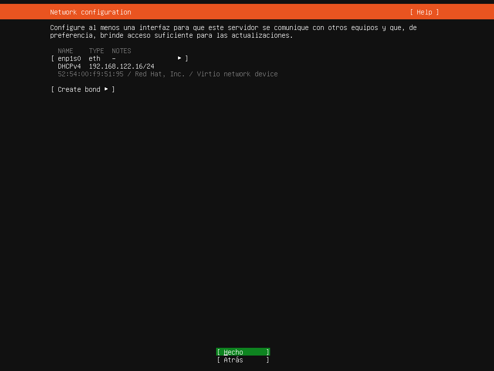
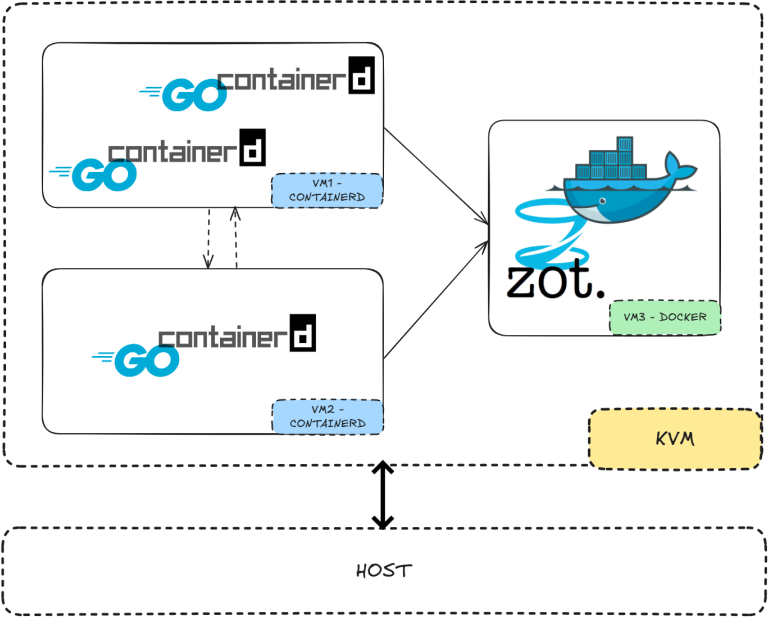
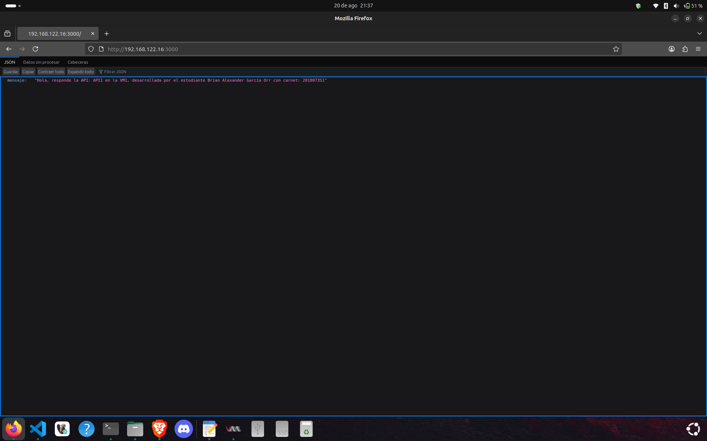
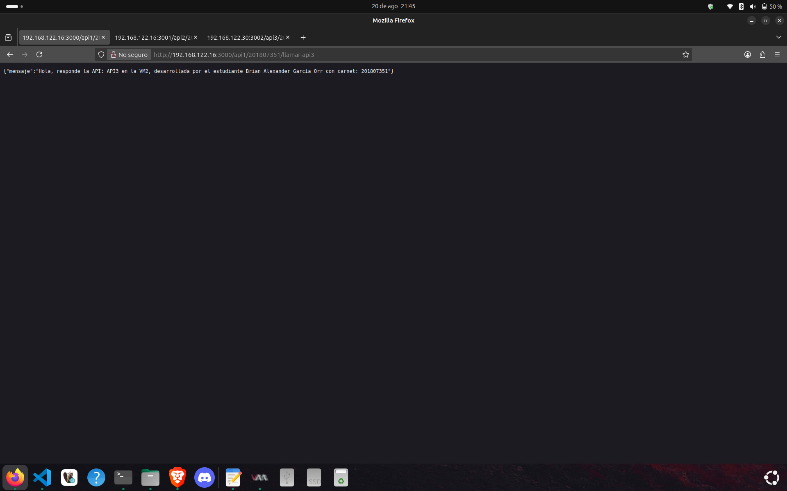
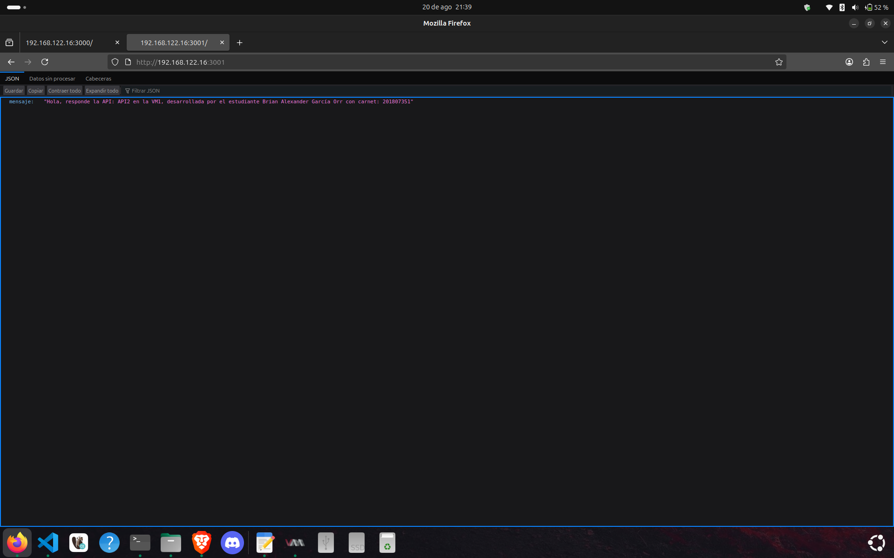
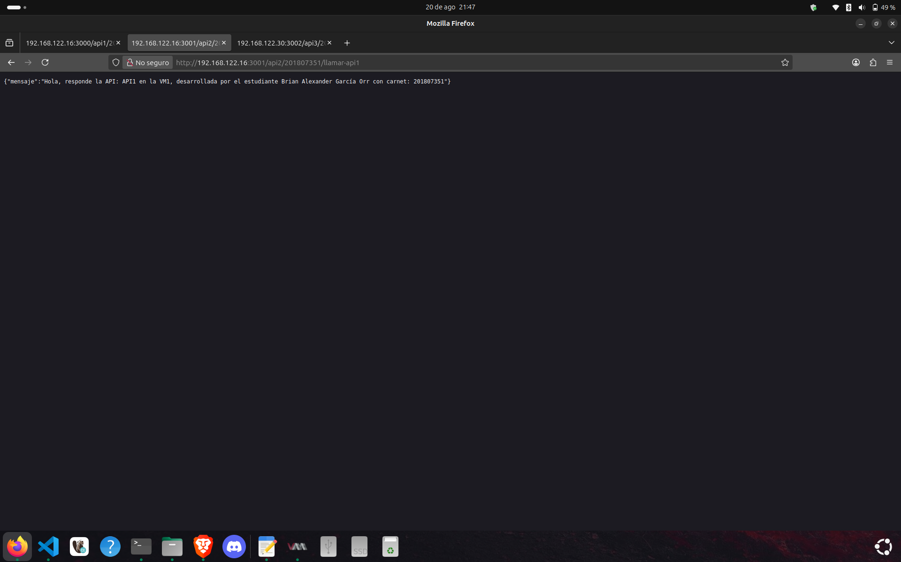
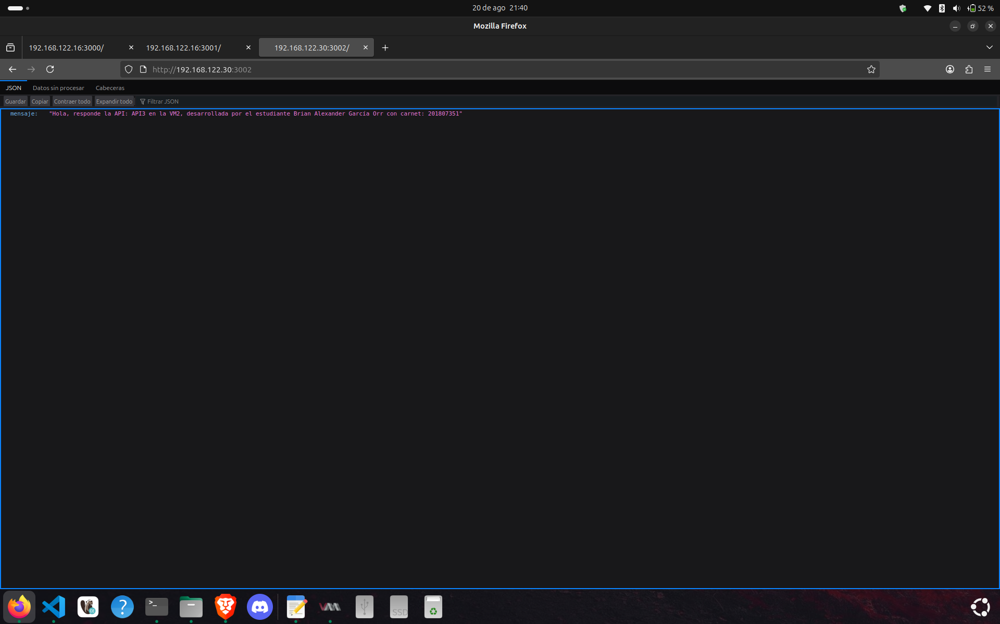
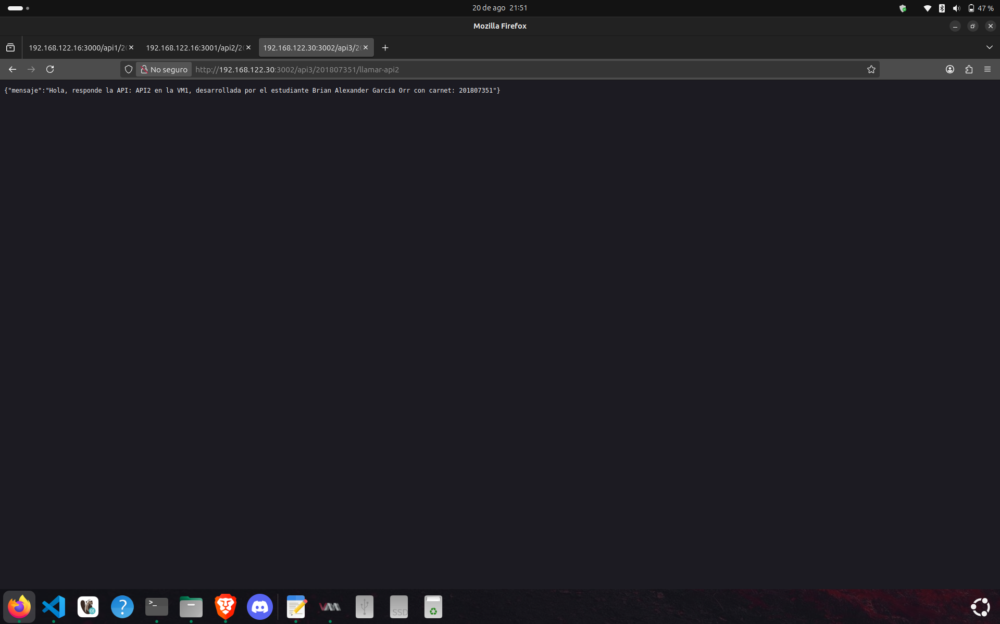

# Guía de instalación y Manual Técnico

1. [Instalación KVM](#instalación-kvm).
2. [Instalación Virtual Machine](#instalación-virtual-machine).
3. [Instalación Docker](#instalación-docker).
4. [Instalación ZOT](#instalación-zot).
5. [Instalación Containers](#instalación-containers).
6. [Flujo de Aplicacion](#flujo-de-aplicacion).
7. [Api's en Golang](#apis-en-go).
8. [Dockerfile](#docker-file).
9. [Funcionamiento de API](#funcionamiento-de-api).

## ___Instalación KVM___

### ___Verificar si tu CPU soporta virtualización:___
Primero, asegúrate de que tu CPU soporta virtualización (Intel VT-x o AMD-V):

```
egrep -c '(vmx|svm)' /proc/cpuinfo
```

* Si el resultado es 0, tu CPU no soporta virtualización o está desactivada en la BIOS.
* Si es 1 o más, tu CPU soporta KVM.

### ___Instalar los paquetes necesarios___
Instala KVM y herramientas asociadas:
```
sudo apt update
sudo apt install qemu-kvm libvirt-daemon-system libvirt-clients bridge-utils virt-manager
 ```
* qemu-kvm: El paquete principal de KVM.
* libvirt: Para gestionar máquinas virtuales.
* virt-manager: Interfaz gráfica para crear y administrar VMs.

### ___Probar KVM___
Puedes probar creando una VM desde la interfaz gráfica virt-manager:
```
virt-manager

```
## ___Instalación Virtual Machine___
Descargamos Ubuntu Server de la pagina oficial, para esta ocasion utilizaremos la version 22.04: https://ubuntu.com/download/server/thank-you?version=22.04.5&architecture=amd64&lts=true

Para la instalacion de las maquinas virtuales nos apoyaremos con el siguiente video: https://www.youtube.com/watch?v=fjCWPm-BDto

__Nota: Es impotante que guarde las direcciones ip, como lo muestra las siguiente imagen.__



Luego nos apoyaremos de este video, para la instalacion de las maquinas virtuaesS
## ___Instalación Docker___
La instalacion de docker para la Maquina Virtual 3 es muy sencilla, ya que esta va a ser la encargada de manejar las imagenes junto con zot, estos serian los comandos:
```
sudo apt-get update
sudo apt-get upgrade
sudo apt-get install docker.io
```

__Nota: Es muy importante instalar docker en la maquina host, ya que es la que compartira toda la informacion a la Maquina Virtual 3__

Pueden utilizar los comandos antes descritos o pueden ir a la pagina oficial donde lo pueden instalar: https://docs.docker.com/get-started/get-docker/

## ___Instalación ZOT___
### ___Iniciar el registro Zot en la VM con DOCKER___
```
docker run -d -p 5000:5000 --name zot ghcr.io/project-zot/zot-linux-amd64:latest
```

### ___Configuración de Docker para que pueda subir la imagen a la VM___
__Nota: Esta configuracion se debe de aplicar en la computadora host, donde realizamos las API's__
Editamos las configuracion de docker con el siguiente comando:
```
sudo nano /etc/docker/daemon.json
```

Ahora modificamos el contenido del archivo, colocamos lo siguiente:
```
{
    "insecure-registries": ["<IP_VM_DOCKER>:5000"]
}
```
Donde <IP_VM_DOCKER> es la ip de la maquina virtual que tendra zot y docker, cabe recalcar que no el la maquina host.

Como siguiente y ultimo paso, reiniciaremos docker con este comando:
```
sudo systemctl restart docker
```
## ___Instalación Containers___

Para instalar containerd en las maquinas virtuales que utilizaran las api's creadas se debe seguir los siguientes comandos:

```
sudo apt-get update
sudo apt-get install ca-certificates curl
sudo install -m 0755 -d /etc/apt/keyrings
sudo curl -fsSL https://download.docker.com/linux/ubuntu/gpg -o /etc/apt/keyrings/docker.asc
sudo chmod a+r /etc/apt/keyrings/docker.asc

# Add the repository to Apt sources:
echo \
  "deb [arch=$(dpkg --print-architecture) signed-by=/etc/apt/keyrings/docker.asc] https://download.docker.com/linux/ubuntu \
  $(. /etc/os-release && echo "${UBUNTU_CODENAME:-$VERSION_CODENAME}") stable" | \
  sudo tee /etc/apt/sources.list.d/docker.list > /dev/null
sudo apt-get update

# Install containerd from the Docker repository:
sudo apt-get install containerd.io

```

## ___Flujo de aplicacion___


## __Api's en Go__
Como primer paso debemos crear el proyecto, esto lo logramos con este comando:
```
go mod init <NOMBRE DEL PROYECTO>
```
Seguidamente utilizamos este comando para hacer uso del framework fiber:
```
go get github.com/gofiber/fiber/v2
```
Al utilizar los 2 comandos descritos nos crearan 2 carpetas o modulos, con los siguientes nombres:
* go.mod
* go.sum

Creamos un archivo main.go y creamos nuestra Api como el siguiente ejemplo:
```
package main

import (
	"io"
	"net/http"
	"os"
	"time"

	"github.com/gofiber/fiber/v2"
)

type Message struct {
	Mensaje string `json:"mensaje"`
}

func env(k, def string) string {
	if v := os.Getenv(k); v != "" {
		return v
	}
	return def
}

func selfMessage() Message {
	api := env("API_NAME", "API1")
	vm := env("VM_NAME", "VM1")
	student := env("STUDENT_NAME", "Brian Alexander García Orr")
	carnet := env("CARNET", "201807351")
	return Message{
		Mensaje: "Hola, responde la API: " + api + " en la " + vm +
			", desarrollada por el estudiante " + student + " con carnet: " + carnet,
	}
}

func main() {
	app := fiber.New()
	client := &http.Client{Timeout: 4 * time.Second}

	// Raíz: devuelve el JSON requerido
	app.Get("/", func(c *fiber.Ctx) error {
		return c.Status(fiber.StatusOK).JSON(selfMessage())
	})

	// /api1/201807351/llamar-api2
	app.Get("/api1/201807351/llamar-api2", func(c *fiber.Ctx) error {
		url := env("API2_URL", "http://VM1:3001")
		resp, err := client.Get(url)
		if err != nil {
			return c.Status(fiber.StatusInternalServerError).JSON(fiber.Map{"error": "Error llamando a API2", "detalle": err.Error()})
		}
		defer resp.Body.Close()
		body, _ := io.ReadAll(resp.Body)
		return c.Send(body) // Reenvía la respuesta JSON de la otra API
	})

	// /api1/201807351/llamar-api3
	app.Get("/api1/201807351/llamar-api3", func(c *fiber.Ctx) error {
		url := env("API3_URL", "http://VM2:3002")
		resp, err := client.Get(url)
		if err != nil {
			return c.Status(fiber.StatusInternalServerError).JSON(fiber.Map{"error": "Error llamando a API3", "detalle": err.Error()})
		}
		defer resp.Body.Close()
		body, _ := io.ReadAll(resp.Body)
		return c.Send(body)
	})

	app.Listen("0.0.0.0:3000")
}
```

## ___Docker File___
Para poder crear nuestras imagenes con todo lo necesario que necesitamos en nuestro contenedor debemos crear un dockerfile con el siguiente contenido:

```
# Etapa de compilación
FROM golang:1.22-alpine AS build
WORKDIR /src

# Copiar dependencias
COPY go.mod ./
COPY go.sum ./
RUN go mod download

# Copiar el código fuente
COPY . .

# Compilar el binario
RUN CGO_ENABLED=0 GOOS=linux GOARCH=amd64 go build -o /out/app

# Imagen final
FROM alpine:3.20
WORKDIR /
COPY --from=build /out/app /app
EXPOSE 3000
ENTRYPOINT ["/app"]
```

__Nota: Es importante recordar que se debe realizar un Dockerfile por cada API__

Para poder realizar la ejecucion de dicho archivo se debe ejecutar el siguiente comando:

```
#Comando para el Dockerfile de la API 1
docker build --no-cache -t virtualmachine1:API-1 .

#Comando para el Dockerfile de la API 2
docker build --no-cache -t virtualmachine1:API-2 .

#Comando para el Dockerfile de la API 3
docker build --no-cache -t virtualmachine2:API-3 .
```

Cabe recalcar que todo esto se realiza desde la maquina host desde la path donde se encuentra cada archivo.

### __Creacion de tag para las imagenes__
Al crear las imagenes, vamos a darle un tag como un alias a las imagenes lo cual se lo daremos con el siguiente comando, __importante la ip que se observa ahi es la de la VM que contiene zot y docker:__
```
# API1 (VM1)
docker tag virtualmachine1:API-1 192.168.122.169:5000/virtualmachine1:API-1

# API2 (VM1)
docker tag virtualmachine1:API-2 192.168.122.169:5000/virtualmachine1:API-2

# API3 (VM2) → corrigiendo el typo
docker tag virtualmachine2:API-3 192.168.122.169:5000/virtualmachine2:API-3

```

### __Subida de las imagenes a ZOT__
Utilizamos estos comandos para subir la imagen a nuestra maquina virtual que contiene zot:
```
docker push 192.168.122.169:5000/virtualmachine1:API-1
docker push 192.168.122.169:5000/virtualmachine1:API-2
docker push 192.168.122.169:5000/virtualmachine2:API-3
```

Utilizamos este comando para verificar que haya subido exitosamente nuestro catalogo:
```
curl http://192.168.122.169:5000/v2/_catalog

# Deberia aparecer repositories[virtualmachine1, virtualmachine2] en el caso que se utilicen los mismos nombres que aparece en el codigo 
```

### __Obtener las imagenes en la VM1 y VM2__

Para obtener las imagenes utilizaremos el siguiente comando, __importante la ip que aparece es la ip de la maquina que contiene a zot, en este caso la VM3__:
```
# Estos comandos se realizaran en la VM1
sudo ctr images pull --plain-http 192.168.122.169:5000/virtualmachine1:API-1
sudo ctr images pull --plain-http 192.168.122.169:5000/virtualmachine1:API-2

#Este comando se realizara en la VM2
sudo ctr images pull --plain-http 192.168.122.169:5000/virtualmachine2:API-3

```

### __Ejecucion de imagenes en la VM__
Para ejecutar las imagenes en las VM se utilizara el siguiente comando para crear el task y correrlas en segundo plano:

```
sudo ctr run -d --net-host 192.168.122.169:5000/virtualmachine1:API-1 api-1
sudo ctr run -d --net-host 192.168.122.169:5000/virtualmachine1:API-2 api-2
sudo ctr run -d --net-host 192.168.122.169:5000/virtualmachine2:API-3 api-3
```

## ___Funcionamiento de API___
* ___API1 en linea y corriendo___

* ___API1 llamndo a API2___

* ___API1 llamndo a API3___


* ___API2 en linea y corriendo___

* ___API2 llamndo a API1___

* ___API2 llamndo a API3___


* ___API3 en linea y corriendo___

* ___API3 llamndo a API1___

* ___API3 llamndo a API2___
